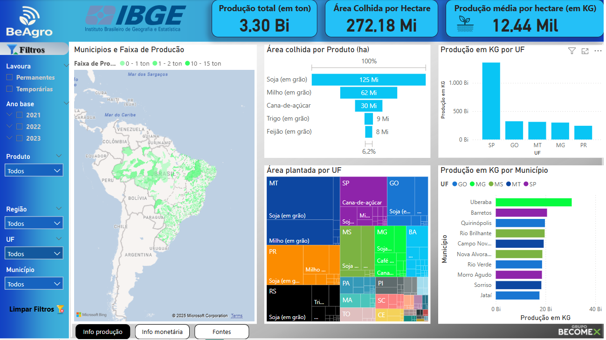
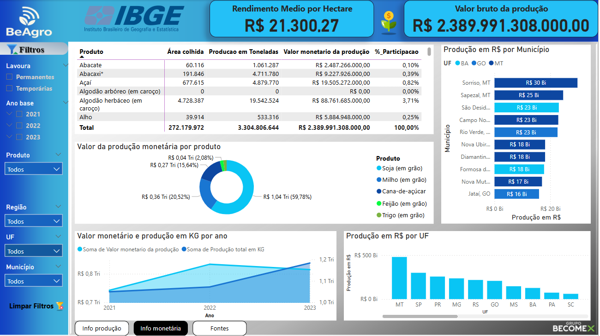
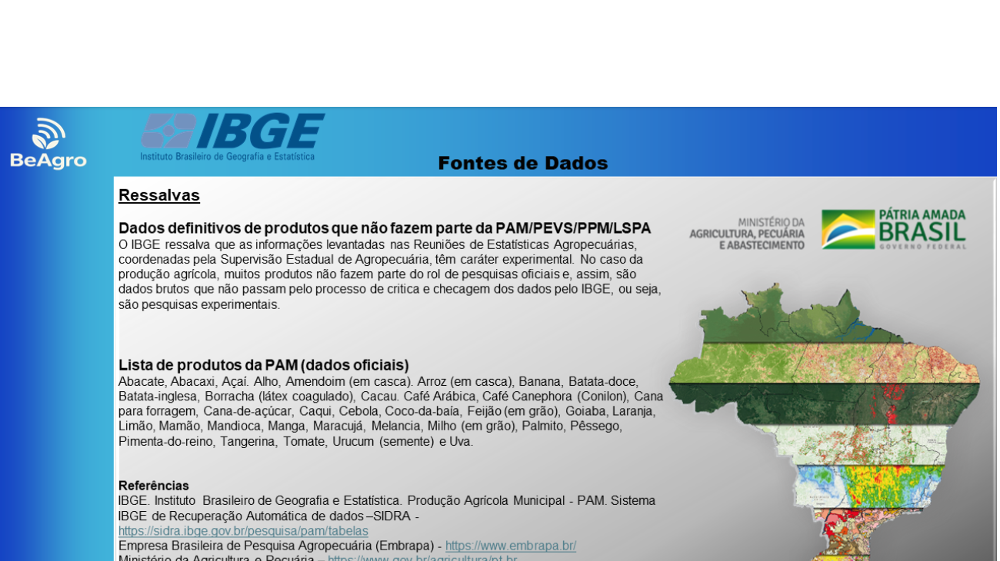

# 📊 Projeto Becomex - Análise de Dados IBGE

Este repositório apresenta um projeto completo de análise de dados com foco em informações extraídas do IBGE, abordando desde a coleta, tratamento e análise de dados até a visualização final em um dashboard interativo no Power BI.

## 📌 Objetivo

O objetivo deste projeto é demonstrar a aplicação prática do processo de **ETL (Extração, Transformação e Carga)** em dados públicos do IBGE, com foco em produção agrícola. As informações são organizadas e apresentadas de forma clara e estratégica para facilitar a tomada de decisão.

---

## 🛠️ Tecnologias e Ferramentas Utilizadas

- **Python**: Para extração e tratamento de dados.
- **Pandas**: Manipulação e limpeza de dados.
- **Power BI**: Criação de dashboards e visualizações interativas.
- **APIs públicas (SIDRA/IBGE)**: Fonte dos dados utilizados.
- **Jupyter Notebook / Colab**: Ambiente de desenvolvimento e testes.
- **Git e GitHub**: Controle de versão e hospedagem do projeto.

---

## 📂 Estrutura do Projeto

```bash
Projeto_Becomex_AnaliseDados_IBGE/
│
├── dados/                           # Dados brutos e processados
│   ├── Base Inicial do BaixaSidra/
│   └── Base tratada
├── material apoio/                  # Capturas do dashboard e gráficos
│   ├── imagens/
│   ├── dashboard1.png
│   ├── dashboard2.png
│   └── dashboard3.png
├── notebooks/                       # Códigos de tratamento e exploração
│   └── Tratamento_Dados_Colab
├── powerBI/                         # Arquivos .pbix do dashboard
│   └── Dash_Becomex_grupo04
├── src/                             # Scripts Python para extração e manipulação
├── .gitattributes
├── Apresentação Final - Grupo04.pptx
├── Documentação Técnica do Projeto.docx
├── LICENSE
├── README.md                        # Este arquivo
└── requisitos.txt                   # dependências do projeto

```

---

## ⚙️ Como Executar o Projeto

1. **Clone o repositório**:

```bash
git clone https://github.com/MarcioLuizBR/Projeto_Becomex_AnaliseDados_IBGE.git
```

2. **Instale as bibliotecas necessárias**:

> Recomendado o uso de um ambiente virtual

```bash
pip install -r requisitos.txt
```

3. **Execute os notebooks** da pasta `notebooks/` para realizar a extração e o tratamento dos dados.

4. **Abra o arquivo Power BI (.pbix)** localizado na pasta `powerBI/` para visualizar o dashboard com os dados tratados.

---

## 📈 Resultados e Visualizações

O dashboard interativo permite:

- Comparar a produção agrícola por município.
- Analisar o rendimento médio por hectare por estado.
- Visualizar tendências e padrões em diferentes culturas agrícolas.

> Capturas de tela do dashboard:





---

## 🚀 Aprendizados

Durante o desenvolvimento deste projeto, foram aplicados conceitos importantes como:

- Acesso a dados públicos via API REST (IBGE/SIDRA).
- Limpeza e padronização de dados com Pandas.
- Análise exploratória de dados (EDA).
- Criação de visualizações dinâmicas com Power BI.

---

## 📌 Próximos Passos

- Refinamento visual do dashboard.
- Inclusão de novas variáveis (ex: PIB, população).
- Publicação online via Power BI Service.

---

## 👨‍💼 Autores

Desenvolvido por:
[Marcio Luiz](https://www.linkedin.com/in/marcioluiz-multicloud/)\
📧 Para contato: [marcio.asriel@gmail.com](mailto\:marcio.asriel@gmail.com)
[Thiago]()\
📧 Para contato: []()
[Lucas]()\
📧 Para contato: []()
[Luiz]()\
📧 Para contato: []()
[Guilherme Marcondes](https://www.linkedin.com/in/guilhermempereira80/)\
📧 Para contato: [marcondespereiraguilherme@gmail.com](mailto\:marcondespereiraguilherme@gmail.com)
---

## 📝 Licença

Este projeto está sob a licença MIT. Consulte o arquivo [LICENSE](LICENSE) para mais informações.

