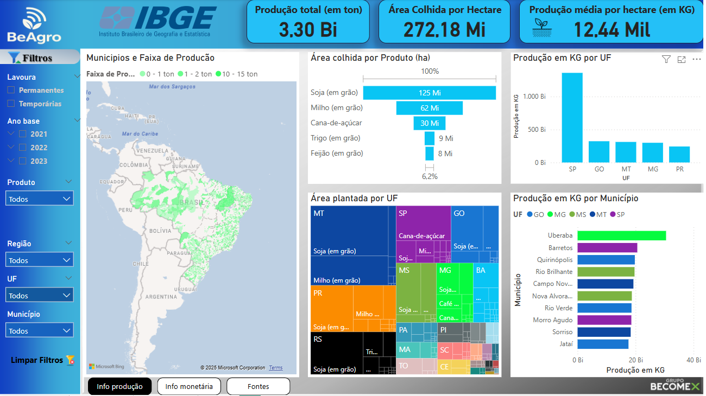
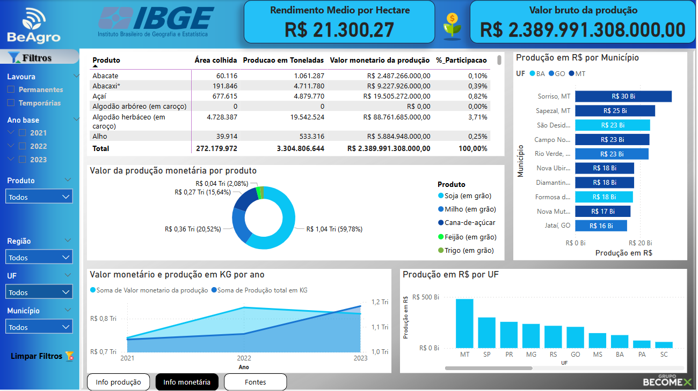
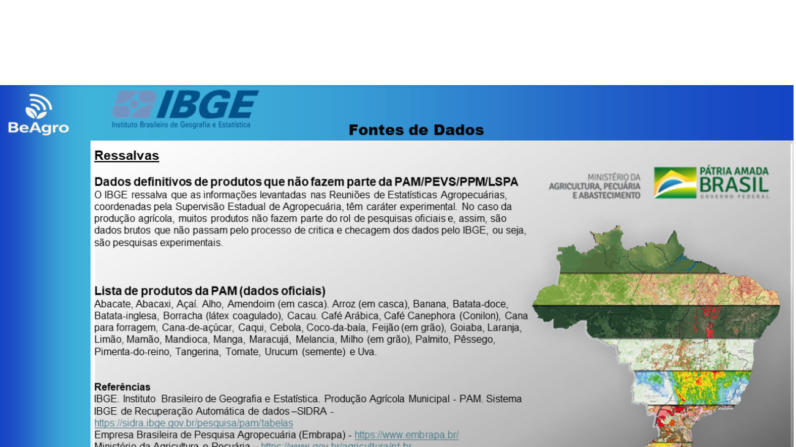

# 📊 Projeto Becomex — Análise de Dados do IBGE

Este projeto apresenta uma solução completa de **análise de dados públicos do IBGE**, com foco em **produção agrícola**, abrangendo todo o pipeline de dados — da extração via API até a visualização final em **dashboard interativo no Power BI**.

O objetivo é transformar dados brutos em **insights claros e acionáveis para apoio à tomada de decisão**.

---

## 🎯 Objetivo de Negócio

Demonstrar, na prática, a aplicação do processo de **ETL (Extração, Transformação e Carga)** utilizando dados públicos do IBGE, organizando e analisando informações de produção agrícola para:

- identificar padrões e tendências
- comparar desempenho entre regiões e estados
- apoiar análises econômicas e estratégicas

---

## 🧩 Fonte de Dados

- **IBGE / SIDRA** — Produção Agrícola Municipal (PAM)  
- Dados oficiais, públicos e amplamente utilizados em análises econômicas e setoriais

---

## 🏗️ Pipeline de Dados (ETL)

1. **Extração**  
   - Consumo da API REST do IBGE (SIDRA)
2. **Transformação**  
   - Limpeza, padronização e tratamento com Pandas
   - Organização por cultura, estado, município e ano
3. **Carga**  
   - Dados tratados utilizados no Power BI para visualização

---

## 🛠️ Tecnologias Utilizadas

- **Python** — extração e tratamento de dados  
- **Pandas** — limpeza e transformação  
- **API IBGE / SIDRA** — fonte dos dados  
- **Power BI** — dashboards interativos  
- **Jupyter Notebook / Google Colab** — desenvolvimento e testes  
- **Git & GitHub** — versionamento e documentação  

---

## 📁 Estrutura do Projeto

```
Projeto_Becomex_AnaliseDados_IBGE/
│
├── dados/
│   ├── Base Inicial BaixaSidra/
│   └── Base tratada/
│
├── material apoio/
│   └── imagens/
│       ├── dashboard1.png
│       ├── dashboard2.png
│       └── dashboard3.png
│
├── notebooks/
│   └── Tratamento_Dados_Colab.ipynb
│
├── powerBI/
│   └── Dash_Becomex_grupo04.pbix
│
├── src/
│   └── BaixaSidra/
│
├── Apresentação Final - Grupo04.pptx
├── Documentação Técnica Projeto.docx
├── requisitos.txt
└── README.md
```

> Capturas de tela do dashboard:





---

## ▶️ Como Executar o Projeto

1. Clone o repositório:

```bash
git clone https://github.com/MarcioLuizBR/Projeto_Becomex_AnaliseDados_IBGE.git
```

2. Instale as dependências:

```bash
pip install -r requisitos.txt
```

3. Execute os notebooks da pasta `notebooks/` para realizar a extração e tratamento dos dados  
4. Abra o arquivo **Power BI (.pbix)** na pasta `powerBI/` para visualizar o dashboard

---

## 📈 Resultados e Visualizações

O dashboard interativo permite:

- comparar produção agrícola por município
- analisar rendimento médio por hectare por estado
- visualizar tendências por cultura agrícola
- avaliar valor bruto da produção ao longo do tempo

> As imagens do dashboard estão disponíveis na pasta `material apoio/imagens/`.

---

## 💡 Principais Insights

- Identificação das culturas com maior participação no valor bruto da produção
- Comparação regional de produtividade agrícola
- Evolução da produção e rendimento ao longo dos anos analisados

---

## 🚀 Aprendizados Técnicos

- Consumo de APIs públicas (REST)
- Processos de ETL com Python
- Análise exploratória de dados (EDA)
- Modelagem de dados para BI
- Construção de dashboards analíticos no Power BI

---

## 🔭 Próximos Passos

- Refinamento visual do dashboard
- Inclusão de novas variáveis (PIB, população, indicadores econômicos)
- Publicação online via Power BI Service
- Automatização do pipeline de atualização de dados

---

## 👨‍💻 Autores

Projeto desenvolvido por:

- **Marcio Luiz**  
- Thiago Lira  
- Lucas Silva  
- Guilherme Marcondes  
- Luiz Felipe  

---

## 📄 Licença

Este projeto está sob a licença MIT. Consulte o arquivo LICENSE para mais informações.
